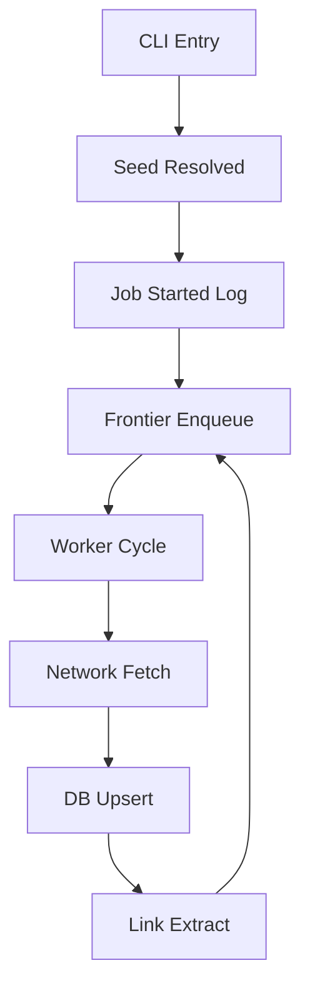

# Web Crawler Engineering Specification: CRAWL Mode

This document serves as the **definitive technical reference** for the Web Crawler's `CRAWL` mode. It provides an exhaustive breakdown of the system's architecture, logic, and failure-handling mechanisms.

---

## 1. Requirements & Dependency Specification
The system is built on a specialized stack designed for high-concurrency scraping and WAF bypass.

| Library | Role | Technical implementation Context |
| :--- | :--- | :--- |
| `requests` | **Network Core** | Implements synchronous HTTPS fetching. Utilizes `urllib3` for connection pooling. Configured with `verify=False` and `allow_redirects=False` for manual hop control. |
| `playwright`| **DOM Rendering** | Manages headless Chromium. Used for SPAs or when WAF routing artifacts (403/401) trigger an escalation. |
| `beautifulsoup4`| **Parsing Engine**| Extracts anchor and asset tags using the `lxml` speed-optimized tree builder. |
| `mysql-connector`| **Persistence** | Manages the thread-safe `MySQLConnectionPool`. |
| `tldextract` | **Boundary Lock** | Extracts the `registered_domain` to prevent "domain drift" during redirects. |
| `python-dotenv` | **Orchestration** | Loads environmental variables from `.env` to synchronize scaling and DB limits. |
| `brotli` | **Decompression** | Enables decoding of modern response headers (Cloudflare/Brotli). |

---

## 2. Configuration & CLI Infrastructure

### 2.1 Environmental Variables (`.env`)
| Variable | Code Usage | Impact on System |
| :--- | :--- | :--- |
| `MYSQL_POOL_SIZE` | `mysql.py`, `db_guard.py` | Sets the maximum concurrent DB connections and `DB_SEMAPHORE` limit. |
| `MIN_WORKERS` | `main.py`, `core.py` | The base number of threads spawned per site. |
| `MAX_WORKERS` | `main.py`, `core.py` | The ceiling for dynamic scaling in `CRAWL` mode. |
| `MAX_PARALLEL_SITES`| `main.py`, `core.py` | Limits the number of sites processed concurrently in `ThreadPoolExecutor`. |
| `CRAWL_MODE` | `main.py` | Sets default behavior (CRAWL, BASELINE, COMPARE). |

### 2.2 CLI Argument Flow
Arguments in `main.py` are mapped to internal parameters:
- `--mode`: Overrides `CRAWL_MODE`. Cascades to `CrawlerWorker` and `BaselineWorker`.
- `--parallel`: Triggers `ThreadPoolExecutor` orchestration.
- `--siteid`: Filters `fetch_enabled_sites` result set.
- `--max_parallel_sites`: Overrides `.env` concurrency limit.

---

## 3. Networking & WAF Bypass (High-Fidelity)

### 3.1 Strict HTTPS Enforcement
All connections are forced to HTTPS at two points:
1. **Normalization**: `LinkUtility.normalize_url_for_fetch` rewrites all `http://` to `https://`.
2. **Redirect Loop**: `PageFetcher.fetch` manually upgrades `Location` headers before the next hop.

### 3.2 WAF Bypass Mechanics
When a `waf_ip` is assigned:
- **Requests Layer**: The `netloc` is substituted in the URL, but the original domain is preserved in the `Host` header to ensure valid SNI and application-level routing.
  ```python
  # processor.py: PageFetcher.fetch
  if waf_ip:
      ip_url = urlunparse(parsed._replace(netloc=waf_ip))
      headers["Host"] = parsed.netloc
      response = requests.get(ip_url, headers=headers, verify=False)
  ```
- **Playwright Layer**: Uses native Chromium socket mapping.
  ```python
  # js_engine.py: BrowserManager.render_sync
  args = [f"--host-rules=MAP {primary_host} {waf_ip}"]
  ```

---

## 4. Execution Policy & Skip Rules
The `ExecutionPolicy` class in `engine.py` defines the system's filtering logic.

### 4.1 Path Skip Rules (Regex)
| Rule | Pattern | Purpose |
| :--- | :--- | :--- |
| `TAG_PAGE` | `^/(product-)?tag/` | Avoids tag cloud crawler traps. |
| `AUTHOR_PAGE`| `^/author/` | Prevents crawling user profiles. |
| `PAGINATION` | `/page/\d*/?$` | Skips standard numbered page lists. |
| `ASSETS` | `^/(assets|static|...|js)/` | Blocks direct directory crawling. |

### 4.2 Query Skip Rules
Skip URLs containing: `page`, `orderby`, `sort`, `add-to-cart`, `utm_`, `_gl=`.

### 4.3 Domain Locking
Ensures links don't escape to external sites.
- **Mechanism**: `tldextract` extracts `registered_domain` from the seed and candidate. If they mismatch, the link is discarded.

---

## 5. Frontier & Worker Internals

### 5.1 The Frontier Cycle
The `Frontier` class manages a thread-safe `Queue` and three key sets:
1. `visited`: Tracks fully processed URLs.
2. `in_progress`: Prevents duplicate fetching by different workers.
3. `discovered`: Global set of all identified URLs (used for session stats).

### 5.2 Worker Lifecycle (`CrawlerWorker`)
- **Dequeue**: Blocks until a URL is available or `in_progress` is empty.
- **Throttling**: Consults `TrafficControl.get_remaining_pause` before every request.
- **Logging**: Every save or failure is logged with a unique worker name (e.g., `Worker-123-1`).

---

## 6. The 5-Layer Fallback Hierarchy

| Tier | Safeguard | Implementation Log | Technical Logic |
| :--- | :--- | :--- | :--- |
| **1. DB Guard** | `DB_SEMAPHORE` | `[DB] Semaphore timeout` | Limits concurrency to match connection pool size. |
| **2. Routing** | IP -> DNS Fallback| `[BYPASS] Falling back to Public DNS` | Reverts to public IP if WAF IP is unreachable via socket check. |
| **3. Rendering**| HTTPS -> JS Fallback| `[FETCH] JS rendering required` | Escalates to Playwright if initial probe reveals SPA structures. |
| **4. Rate Limit**| 5s Pause + Scale| `[THROTTLE] Setting DOMAIN-WIDE PAUSE`| Scales workers down to `MIN_WORKERS` to recover from 429 errors. |
| **5. Watchdog** | os._exit() | `FATAL: Watchdog timer expired!` | Force-kills the process if no activity is logged for 15 minutes. |

---

## 7. Phase-by-Phase I/O Flow Mapping

| Function | Input | Output | Semantic Context |
| :--- | :--- | :--- | :--- |
| `resolve_seed_url` | `raw_url` | `resolved_url` | Validates and probes seed variations. |
| `Frontier.enqueue` | `url`, `origin` | `status` | Normalizes and performs duplicate/policy checks. |
| `PageFetcher.fetch` | `url`, `waf_ip` | `result_dict` | Executes network request with WAF bypass. |
| `insert_crawl_page`| `page_data` | `action_info` | Syncs page metadata and status to DB. |
| `LinkExtractor.extract`| `html`, `base` | `(urls, assets)` | Parsed discovery and audit targets. |

---

## 8. Annotated Flowchart: Block-to-Code Mapping



| Block | File | Function | Log Statement | Snippet |
| :--- | :--- | :--- | :--- | :--- |
| **B** | `main.py` | `resolve_seed_url` | `Starting URL : {url}` | variation probing |
| **F** | `processor.py`| `PageFetcher.fetch`| `[FETCH] HTTP 200` | Netloc substitution |
| **G** | `mysql.py` | `insert_crawl_page`| `[DB] Inserted {id}` | ON DUPLICATE UPDATE |
| **H** | `processor.py`| `LinkExtractor` | `[INFO] Enqueued {n}` | Regex path filtering |

---

## 9. Crawler Summary Tables
Final aggregation logic in `main.py` using `SUMMARY_LOCK`:

| Pillar Metric | Technical Source | Calculation |
| :--- | :--- | :--- |
| **Total Attempted**| `stats["visited_count"]` | All items marked `visited` in Frontier. |
| **Newly Saved** | `w.saved_count` | Sum of successful `INSERT` actions from workers. |
| **Already in DB** | `w.existed_urls` | Set of URLs returning `Existed` action from DB. |
| **Throttles** | `w.failed_throttle_count`| Total 429/503 events across all threads. |
| **JS Rendering** | `w.js_render_stats` | Count of successful Playwright render cycles. |
