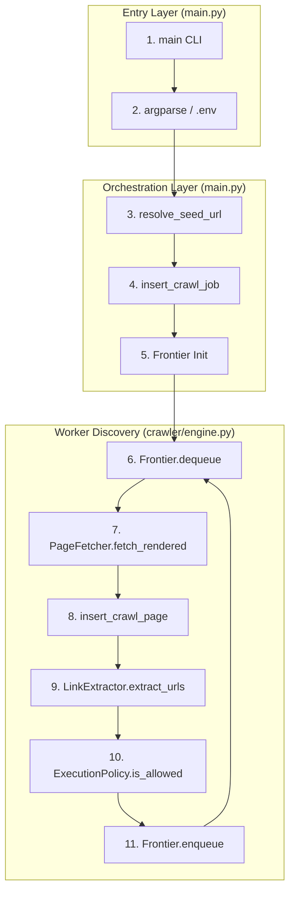

# Web Crawler Documentation: CRAWL Mode Technical Guide

## 1. Requirements & Dependency Deep-Dive
The crawler relies on a specific set of libraries to handle networking, parsing, and persistence. Below is the functional role of each dependency within the `CRAWL` mode context.

| Library | Role in CRAWL Mode | Use Case & Interaction |
| :--- | :--- | :--- |
| `requests` | Initial Probing & Fetching | Used in `resolve_seed_url` (http/https validation) and `PageFetcher.fetch` (standard HTML retrieval). Handles connection pooling and redirects. |
| `playwright`| JS Rendering (Escalation) | Headless Chromium management. Used when standard requests fail to find links or trigger JS-heavy sites via `BrowserManager`. |
| `beautifulsoup4`| HTML Parsing | Primary engine for converting raw HTML into a DOM-like structure for the `LinkExtractor`. |
| `lxml` | Parsing Accelerator | Provides a faster backend for BeautifulSoup to handle large documents during link extraction. |
| `mysql-connector-python`| Data Persistence | Manages the thread-safe `MySQLConnectionPool`. Handles all interactions with `crawl_jobs` and `crawl_pages`. |
| `tldextract` | Domain Boundary Logic | Used by `ExecutionPolicy` to ensure workers don't "drift" into external domains by extracting the `registered_domain`. |
| `python-dotenv` | Configuration | Loads `.env` variables into `os.environ` to control worker scaling and resource limits. |
| `brotli` | Content Decoding | Enables the crawler to decode Brotli-compressed response headers from modern web servers (e.g., Cloudflare). |

---

## 2. Networking & Routing (IP/WAF Bypass)
The system uses a sophisticated routing layer to bypass WAF (Web Application Firewall) protections by connecting directly to origin IPs.

### 2.1 WAF Bypass via `requests`
In `PageFetcher`, the `waf_ip` is injected into the session.
```python
# Logic within PageFetcher
if waf_ip:
    session.mount(f"http://{domain}", HostHeaderSSLAdapter(waf_ip))
    session.mount(f"https://{domain}", HostHeaderSSLAdapter(waf_ip))
```
- **Type**: HTTP/HTTPS requests.
- **Mechanism**: Overrides SNI (Server Name Indication) to point to the `waf_ip` while keeping the `Host` header as the domain.

### 2.2 WAF Bypass via `playwright` (Chromium)
The `BrowserManager` uses native Chromium `--host-rules` to enforce routing.
```python
# Logic within BrowserManager._ensure_running
args=[
    f"--host-rules=MAP {domain} {waf_ip}, MAP www.{domain} {waf_ip}",
    "--disable-http2", # Enforce HTTP/1.1 for reliable routing
]
```
- **Reason**: Playwright is used as an **escalation**. If `requests` returns a 403 or empty HTML, the system shifts to browser-level rendering to execute JS.

---

## 3. Data Persistence (DB Interaction)
All crawl state is stored in MySQL. The system uses a pool-based approach with semaphore protection.

### 3.1 `crawl_jobs` (Session Management)
- **Role**: Updates the status of the overall crawl task for a specific site.
- **SQL Snippet**:
  ```sql
  INSERT INTO crawl_jobs (job_id, custid, siteid, start_url, status) 
  VALUES (%s, %s, %s, %s, 'running')
  ```
- **Safety**: Uses `SET FOREIGN_KEY_CHECKS=0` during insertion if the parent `sites` table metadata is being updated simultaneously.

### 3.2 `crawl_pages` (Discovery Log)
- **Role**: Stores every unique URL discovered and its metadata (status code, content length).
- **Canonicalization**: The `LinkUtility.get_canonical_id()` ensures `http://site.com/` and `https://site.com` are treated as the same entry.

---

## 4. The Crawl Cycle: Annotated Flowchart
This flowchart maps every step to its corresponding code structure.



### 4.1 Block-by-Block Code Deep-Dive

#### **Block 3: resolve_seed_url (main.py)**
**Log**: `[INFO] Resolving seed URL for domain.com...`
```python
def resolve_seed_url(raw_url: str) -> str:
    # Probes variations (bracket logic) via HTTP HEAD/GET
    candidates = [raw.rstrip("/"), raw] if raw.endswith("/") else [raw, raw + "/"]
    for u in candidates:
        r = requests.get(u, timeout=12, verify=False) # Skip SSL verification for speed
        if r.status_code < 400: return r.url
```

#### **Block 5: Frontier.initialize (crawler/engine.py)**
**Log**: `[INFO] Initialized Frontier with starting seed: {url}`
```python
def __init__(self):
    self.queue = Queue() # Thread-safe tasks
    self.visited = set() # Finalized URLs
    self.in_progress = set() # Active fetches
```

#### **Block 7: fetch_rendered (crawler/engine.py)**
**Log**: `[FETCH] Site {id} -> GET {url} [Direct-IP: {waf_ip}]`
```python
def fetch_rendered(self, url, waf_ip=None):
    # Step A: Attempt fast Fetch via requests
    res = requests.get(url, headers=HEADERS, stream=True)
    # Step B: Escalation Check
    if JSIntelligence.needs_js_rendering(res.text):
        return BrowserManager.render_sync(url, waf_ip)
```

#### **Block 8: insert_crawl_page (crawler/storage/mysql.py)**
**Log**: `[DB] Inserted: {url} | Status: {code}`
```python
def insert_crawl_page(data):
    # Enforces domain matching via canonical URL
    canonical = LinkUtility.get_canonical_id(data["url"], data["base_url"])
    # Uses connection pool for thread-safe upsert
    cur.execute("INSERT INTO crawl_pages (...) ON DUPLICATE KEY UPDATE status_code=VALUES(status_code)")
```

---

## 5. Functional Mapping: Frontier & Discovery Internals
How the data flows between the Workers and the Central Queue.

### Frontier Data Population
1. **Initial**: `main.py` calls `Frontier.enqueue(seed_url)`.
2. **Discovery**: `LinkExtractor` returns a list of candidate URLs.
3. **Filtering**: `ExecutionPolicy` checks domain registered name and file extensions (e.g., skips `.jpg`, `.pdf`).
4. **Saturation**: `Frontier.enqueue` checks `visited` set. If new, it adds to `queue` and increments `in_progress`.

---

## 6. main.py In-Depth Execution Narrative
1. **Context Loading**: Reads `.env` for `MAX_PARALLEL_SITES` and `MIN_WORKERS`.
2. **Site Aggregation**: Fetches all rows from `sites` table where `custid` or `siteid` matches.
3. **Batch Handling**:
    - If `--parallel`: Splits sites into chunks of 20. Submits to `ThreadPoolExecutor`.
    - If Sequential: Loops through each site, waiting for the previous crawl to `join()`.
4. **Final Reporting**: Once all workers for a domain finish, `complete_crawl_job` marks the DB, and a summary table is logged to the console.

### Crawler Summary Table (Sample Console Output)
| Metric | Value |
| :--- | :--- |
| **Pages Crawled** | 452 |
| **New Discoveries** | 120 |
| **Execution Time** | 145.2s |
| **Memory Peak** | 1.2 GB |
| **WAF Bypass Hits**| 452 |
