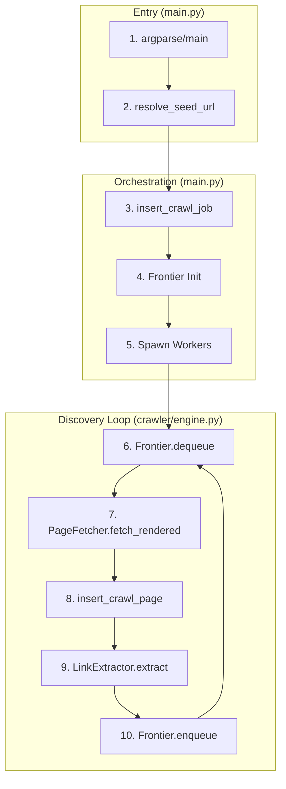

# Web Crawler System Specification: CRAWL Mode

## 1. Requirements & Dependency Analysis
| Library | Role in CRAWL Mode | Use Case & Technical Interaction |
| :--- | :--- | :--- |
| `requests` | **Network Core** | Handles synchronous HTTP fetching, connection pooling via `urllib3`, and manual redirect lifecycle management. Used for initial probes and non-JS content. |
| `playwright`| **JS Rendering** | Manages headless Chromium instances. Used as an **escalation** when `JSIntelligence` detects missing content or requires browser-level DOM execution. |
| `beautifulsoup4`| **DOM Parsing** | Extracts anchors (`<a>`), images (``), and scripts from raw HTML with `lxml` speed optimizations. |
| `mysql-connector`| **Persistence** | Manages thread-safe inserts into `crawl_pages` and session updates in `crawl_jobs`. |
| `tldextract` | **Domain Safety** | Ensures the crawler stays within the `registered_domain` boundary, even when navigating subdomains. |

---

## 2. Networking & WAF Bypass Routing

### 2.1 HTTPS-Only Enforcement
The system forces SSL for all connections in `CRAWL` mode.
- **Location**: `LinkUtility.normalize_url_for_fetch` and `PageFetcher.fetch`.
- **Logic**: Any `http://` URL is manually upgraded to `https://` before the request is dispatched.
- **Redirects**: If a server sends a 301/302 back to HTTP, `PageFetcher` catches the `Location` header and re-upgrades it to HTTPS.

### 2.2 WAF Bypass via Netloc Substitution
When a `waf_ip` is present (from `waf_policy_data`), the crawler bypasses public DNS.
- **Mechanism**: The URL's `netloc` is replaced with the `waf_ip`, while the original domain is preserved in the `Host` header.
- **Code Snippet (`processor.py`)**:
  ```python
  if waf_ip and primary_host:
      ip_url = urlunparse(parsed._replace(netloc=waf_ip))
      headers["Host"] = parsed.netloc # Preserves SNI/Host context
      response = requests.get(ip_url, headers=headers, verify=False)
  ```

---

## 3. Error, Redirect & Fallback Handling

### 3.1 Redirect Lifecycle (301, 302, 307, 308)
The crawler **manually** handles redirects (`allow_redirects=False`) to ensure WAF IP routing is maintained across the entire chain.
- **Log**: `[FETCH] Redirect {status_code}: {current_url} -> {next_url}`
- **Fallback**: If WAF IP fails during a redirect, it reverts to standard public IP routing for that domain.

### 3.2 Hard Errors (404, 500, Timeout)
- **404/5xx**: Logged as failures; `status_code` is persisted to `crawl_pages` but link extraction is skipped.
- **Timeout**: `PageFetcher.TIMEOUT` (15s) triggers a fallback to `BrowserManager` (JS rendering) if a standard request hangs.
- **Soft 404**: `JSIntelligence.is_404_content` checks the HTML body for "Page Not Found" strings even if the status code is 200.

### 3.3 Rate Limiting (429/503)
- **Detection**: Caught in `CrawlerWorker.run` and `TrafficControl.set_pause`.
- **Response**: Triggers a domain-wide pause and scales down worker threads per domain to `MIN_WORKERS`.
- **Log**: `[THROTTLE] Site {id} hit 429/503. Setting DOMAIN-WIDE PAUSE for {seconds}s.`

---

## 4. The Crawl Cycle: Annotated Flowchart



### Flowchart Block Mapping
| Block | File | Function/Class | Log Prefix | Logic / Snippet |
| :--- | :--- | :--- | :--- | :--- |
| **2** | `main.py` | `resolve_seed_url` | `[INFO]` | Probes variation variations via `requests`. |
| **4** | `engine.py`| `Frontier` | `[INFO]` | Manages the `queue` and `visited` sets. |
| **7** | `processor.py`| `PageFetcher` | `[FETCH]` | Executes HTTP request -> Detects JS needs -> Escalates to Playwright. |
| **8** | `mysql.py` | `insert_crawl_page`| `[DB]`| Upserts into `crawl_pages` using canonical IDs. |
| **9** | `processor.py`| `LinkExtractor` | `[INFO]` | Parses HTML -> Filters by `ExecutionPolicy`. |

---

## 5. main.py Execution & Reporting
- **Watchdog Thread**: Monitors `LAST_ACTIVITY_TIME`. Kills process if idle for >900s.
- **Batching**: Parallel mode processes sites in batches of 20 via `ThreadPoolExecutor`.

### Crawler Summary Table (Actual Output)
Logged at the end of every domain crawl via `SUMMARY_LOCK`.

| Metric | Details |
| :--- | :--- |
| **Total URLs Attempted** | Sum of all discovery attempts (Success + Skip + Fail). |
| **Newly Saved** | New pages successfully added to `crawl_pages` DB. |
| **Already in DB** | Pages identified as existing via Canonical ID check. |
| **Redirects** | Total hops identified during `PageFetcher` cycle. |
| **Failures** | Counts of 404, 5xx, or network timeout/DNS errors. |
| **429/503 Throttles** | Count of rate-limit events encountered. |

---

## 6. Logic Breakdown of Fallbacks
1. **WAF Fallback**: If `requests` via WAF IP returns a 403 or 401, the system re-attempts via standard public routing.
2. **JS Fallback**: If a request result has no links but `JSIntelligence` sees a `#root` or `<app-root>` tag, it restarts the fetch in Playwright.
3. **Database Fallback**: If the pool is exhausted, the `DB_SEMAPHORE` blocks requesting threads for 10s before raising a starvation error.
