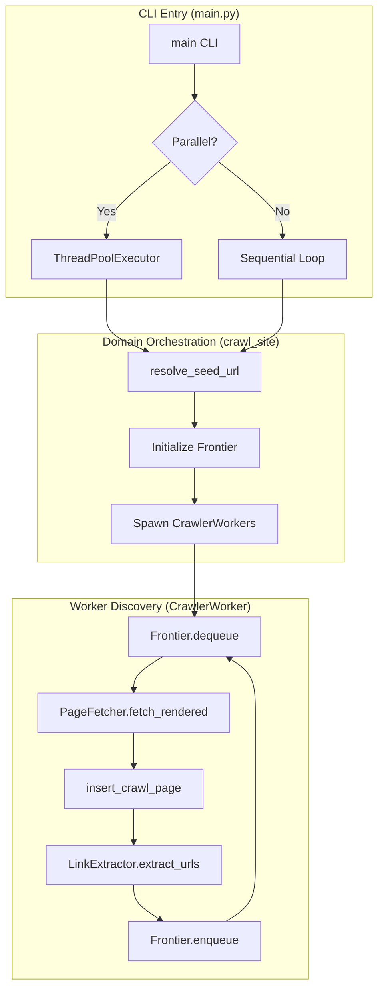

# Web Crawler Documentation: CRAWL Mode Deep Dive

## 1. CLI Argument Flow (The Entry Point)
The crawler begins execution in `main.py` via the `main()` function. CLI arguments are parsed and mapped to internal configuration objects.

### CLI Mapping Table
| Argument | Type | Internal Mapping | Impact on Flow |
| :--- | :--- | :--- | :--- |
| `--mode` | `str` | `CRAWL_MODE` (global) | Sets the execution mode (`CRAWL`, `BASELINE`, `COMPARE`). |
| `--parallel`| `flag`| `args.parallel` | Toggles between `ThreadPoolExecutor` and sequential loops. |
| `--siteid` | `int+`| `args.siteid` | Filters the `sites` list to specific database IDs. |
| `--custid` | `int+`| `args.custid` | Filters the `sites` list to all sites under specified customer IDs. |
| `--log` | `flag`| `args.log` | Enables `FlushingFileHandler` for per-session logging. |

### Entry Logic Snippet (`main.py`)
```python
def main():
    parser = argparse.ArgumentParser(description="Web Crawler / Baseline Tool")
    parser.add_argument("--mode", type=str, choices=["CRAWL", "BASELINE", "COMPARE"])
    parser.add_argument("--parallel", action="store_true")
    # ... parsing logic ...
    
    if args.parallel:
        # PARALLEL FLOW: Batch sites and submit to ThreadPoolExecutor
        with ThreadPoolExecutor(max_workers=max_parallel_sites) as executor:
            future_to_site = {executor.submit(crawl_site, s, args): s for s in batch}
    else:
        # SEQUENTIAL FLOW: One domain after another
        for site in sites:
            crawl_site(site, args)
```

## 2. System Architecture & .env Integration

### .env Configuration Impact
The `.env` file acts as the configuration backbone, defining resource limits and connection strings.

| Variable | Usage in Code | Description |
| :--- | :--- | :--- |
| `MAX_WORKERS` | `crawl_site()` | Defines how many threads (`CrawlerWorker`) per domain. |
| `MAX_PARALLEL_SITES` | `main()` | Sets the `ThreadPoolExecutor` concurrency limit. |
| `MYSQL_POOL_SIZE` | `storage/db.py`| Ensures the DB pool can handle (Workers * Parallel Sites). |

### Parallel vs. Sequential Logic
- **Sequential**: Probes one site at a time. Safe for debugging and avoids database connection spikes.
- **Parallel**: Uses `concurrent.futures.ThreadPoolExecutor`. Sites are processed in batches (default batch size: 20) with a cool-down period between batches to reclaim resources.

## 3. Seed URL "Bracket" Resolution
Before a crawl starts, the system must resolve a "working" URL from the database seed. The "Bracket" logic testing multiple variations.

### Core Logic Snippet (`main.py`)
```python
def resolve_seed_url(raw_url: str) -> str:
    # "Bracket" testing: Try variation without slash vs with slash
    candidates = [raw.rstrip("/"), raw] if raw.endswith("/") else [raw, raw + "/"]
    
    for u in candidates:
        try:
            r = requests.get(u, timeout=12, allow_redirects=True)
            if r.status_code < 400:
                return r.url # Returns final redirected URL after probe
        except: continue
    return raw # Fallback
```

## 4. The Crawl Cycle

### 4.1 Mermaid Flowchart


## 5. Functional Mapping & Granular I/O

### `crawl_site(site, args)`
- **File**: `main.py`
- **Description**: The site manager. Sets up local metrics and spawns discovering threads.
- **Input**: `site` (dict), `args` (cli namespace).
- **Output**: Returns performance summary.
- **Logic**:
  ```python
  def crawl_site(site, args):
      resolved_seed = resolve_seed_url(site["url"])
      frontier = Frontier()
      frontier.enqueue(resolved_seed)
      workers = [CrawlerWorker(frontier, ...) for _ in range(MAX_WORKERS)]
      for w in workers: w.start()
      for w in workers: w.join()
  ```

### `CrawlerWorker.run()`
- **File**: `crawler/engine.py`
- **Description**: The consumer thread that processes the URL queue.
- **Input**: None (Reads from `self.frontier`).
- **Output**: None (Updates `existed_urls` and `saved_count` attributes).
- **Logic**:
  ```python
  def run(self):
      while self.running:
          item, found = self.frontier.dequeue()
          result = PageFetcher.fetch_rendered(url)
          db_res = insert_crawl_page(result)
          if db_res["action"] == "Inserted": self.saved_count += 1
          # Link extraction and re-enqueue follows...
  ```

### `Frontier.enqueue(url)`
- **File**: `crawler/engine.py`
- **Description**: Thread-safe duplicate prevention and queue management.
- **Input**: `url` (str), `discovered_from` (str).
- **Output**: `action` (str: "enqueued", "duplicate", "recursion").
- **Logic**:
  ```python
  def enqueue(self, url, ...):
      normalized = LinkUtility.normalize_url(url)
      with self.lock:
          if normalized in self.visited or normalized in self.in_progress:
              return "duplicate"
          self.in_progress.add(normalized)
          self.queue.put((normalized, ...))
          return "enqueued"
  ```

## 6. Key Modules Deep Dive

### ExecutionPolicy (`crawler/engine.py`)
Determines if a URL "belongs" to the crawl.
```python
@staticmethod
def is_allowed_domain(seed_url, candidate_url, current_url):
    s_ext = tldextract.extract(seed_url)
    c_ext = tldextract.extract(candidate_url)
    # Allows same registered domain (e.g. news.site.in matches site.in)
    return s_ext.registered_domain == c_ext.registered_domain
```

### TrafficControl (`crawler/processor.py`)
Handles domain-wide rate limiting.
```python
@classmethod
def get_remaining_pause(cls, siteid):
    with cls.PAUSE_LOCK:
        pause_end = cls.SITE_PAUSES.get(siteid, 0)
        return max(0, pause_end - time.time())
```

### JS Engine escalations
When `JSRenderWorker` is called:
```python
if urls == [] and JSIntelligence.needs_js_rendering(html):
    # Escalate to Playwright
    html, final_url, status = JS_RENDERER.render(final_url)
    urls, _ = LinkExtractor.extract_urls(html, final_url)
```
