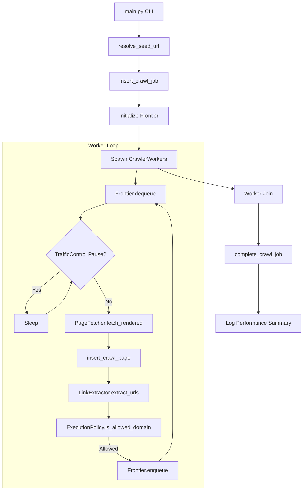

# Web Crawler Documentation: CRAWL Mode

## 1. Introduction
The `CRAWL` mode is designed for **live discovery** of pages on a target website. Unlike `BASELINE` mode, which refetches existing data, `CRAWL` mode actively follows links to discover new content within allowed domain boundaries.

## 2. System Architecture
The `CRAWL` mode operates through a producer-consumer model:
- **`main.py`**: The orchestrator. It resolves the seed URL, initializes the shared `Frontier`, and manages the lifecycle of `CrawlerWorker` threads.
- **`Frontier`**: A thread-safe queue and discovery manager. It tracks visited URLs and manages the work queue.
- **`CrawlerWorker`**: Independent threads that consume URLs from the `Frontier`, fetch content, extract links, and re-enqueue them.
- **`ExecutionPolicy`**: The "brain" that decides which URLs are allowed based on domain boundaries and skip rules (e.g., static assets).

## 3. The Crawl Cycle

### 3.1 Step-by-Step Execution Flow
1. **Invocation**: Running `python main.py --mode CRAWL`.
2. **Seed Resolution**: `resolve_seed_url` tests connectivity and determines the final starting URL (handling redirects).
3. **Job Initialization**: `insert_crawl_job` records the session in the database.
4. **Frontier Setup**: A site-specific `Frontier` is initialized with the seed URL.
5. **Worker Spawning**: Multiple `CrawlerWorker` threads are started.
6. **Fetch and Process Loop**:
    - Worker dequeues a URL from `Frontier`.
    - `TrafficControl` checks if a domain-wide pause is active.
    - `PageFetcher` retrieves the HTML (with optional JS execution).
    - `insert_crawl_page` persists the data to the database.
    - `LinkExtractor` finds new internal links in the HTML.
    - `ExecutionPolicy` filters links.
    - Allowed links are enqueued back to `Frontier`.
7. **Termination**: When the `Frontier` is empty and no workers are active, threads are joined.
8. **Stat Aggregation**: `crawl_site` compiles performance metrics and updates the database via `complete_crawl_job`.

### 3.2 Mermaid Flowchart

## 4. Functional Mapping & I/O Correlations

| Function / Component | File | Inputs | Outputs | Description |
| :--- | :--- | :--- | :--- | :--- |
| `main.crawl_site` | `main.py` | `site` (dict), `args` (Namespace) | Performance Stats | Main per-site orchestrator and worker manager. |
| `resolve_seed_url` | `main.py` | `raw_url` (str) | `resolved_url` (str) | Connectivity check and redirect resolution for seeds. |
| `CrawlerWorker.run` | `crawler/engine.py` | N/A (State-based) | N/A (Updates DB/Frontier) | The main execution loop for discovery threads. |
| `Frontier.enqueue` | `crawler/engine.py` | `url`, `discovered_from`, `depth` | `action` (str: enqueued, duplicate, etc.) | Thread-safe URL deduplication and queuing. |
| `PageFetcher.fetch_rendered`| `crawler/processor.py` | `url`, `siteid`, `force_js` | `result` (dict with HTML, status, time) | Combined HTTP fetching and Playwright rendering. |
| `insert_crawl_page` | `crawler/storage/mysql.py`| `data` (metadata dict) | `result` (dict with action: Inserted/Existed) | Handles MySQL persistence and canonical mapping. |
| `LinkUtility.get_canonical_id`| `crawler/processor.py`| `url`, `base_url`, `enforce_www` | `canonical_url` (str) | Normalizes URLs for consistent DB tracking. |
| `ExecutionPolicy.classify_skip`| `crawler/engine.py` | `url` (str) | `skip_reason` or `None` | Filters URLs based on static extensions and regex rules. |

## 5. Key Modules Details

### ExecutionPolicy
Enforces "Stay within the domain" logic and filters out noise:
- `is_allowed_domain`: Uses `tldextract` to ensure discovery doesn't drift off the registered domain.
- `classify_skip`: Uses `STATIC_EXTENSIONS` (e.g., .jpg, .pdf) and path-based rules to skip non-content pages.

### TrafficControl
Prevents the crawler from being blocked:
- Monitors HTTP 429 (Too Many Requests) and 503 (Service Unavailable).
- Triggers `scale_down` and domain-wide pauses to respect server capacity.

### JS Engine (`JSRenderWorker`)
- Escapes standard HTTP fetching when pages contain minimal HTML or explicit JS links.
- Uses Playwright to render fully dynamic content.

## 6. Configuration & CLI
- **`--mode CRAWL`**: Enables live discovery.
- **`MAX_WORKERS`**: (via `.env`) Controls concurrency per site.
- **`CRAWL_DELAY`**: (via `core.py`) Baseline sleep between requests.

## 7. Observability
- **Logs**: Located in `logs/YYYY-MM-DD/CRAWL_HHMMSS.log`.
- **Database**: 
    - `crawl_jobs`: High-level session status.
    - `crawl_pages`: Detailed result for every URL visited.
- **Console Summary**: Final performance table printed at the end of the run.
