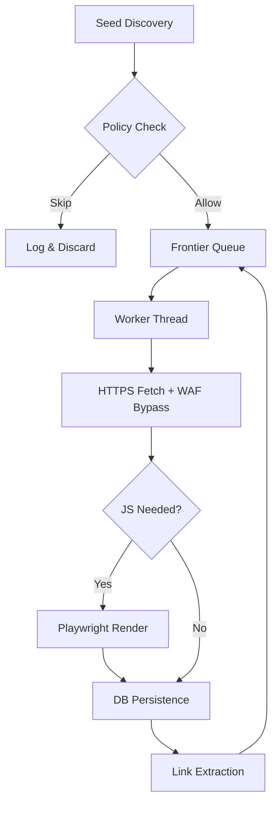

# Web Crawler System Specification: CRAWL Mode

This document provides an ultra-granular technical breakdown of the `CRAWL` mode. It is designed as a definitive reference for developers to understand every layer of the system, from low-level networking and database safeguards to high-level orchestration.

---

## 1. Requirements & Dependency Analysis
The crawler's reliability stems from its specialized use of external libraries.

| Library | Role in CRAWL Mode | Technical Interaction & Scope |
| :--- | :--- | :--- |
| `requests` | **Network Core** | Executes synchronous HTTPS fetches. Configured with `allow_redirects=False` for manual hop tracking and `verify=False` for WAF IP SNI compatibility. |
| `playwright`| **Rendering Escalation** | Spawns headless Chromium. Used when `JSIntelligence` identifies SPAs (Single Page Apps) or when a standard HTTPS probe fails due to routing artifacts (e.g., 403 on hostname WAF IPs). |
| `beautifulsoup4`| **DOM Extraction** | Parses HTML using the `lxml` engine. Specifically targets `<a>`, ``, `<link>`, and `<script>` tags for both discovery and asset auditing. |
| `mysql-connector`| **Data Persistence** | Implements the `MySQLConnectionPool`. Every worker thread acquires and releases connections via the `DB_SEMAPHORE` to prevent pool exhaustion. |
| `tldextract` | **Boundary Enforcement**| Extract's the `registered_domain` (e.g., `google.com`) from arbitrary URLs. This is the **primary anchor** for all `ExecutionPolicy` domain-locking logic. |

---

## 2. Phase-by-Phase I/O Flow Mapping
The internal data flow between modules is standardized to ensure thread-safety and log consistency.

| Phase | Module:Function | Input Data | Output Data | Semantic Logic |
| :--- | :--- | :--- | :--- | :--- |
| **0. Resolution** | `main.py:resolve_seed_url` | `raw_url` | `resolved_url` | Validates domain availability via variation probing. |
| **1. Enqueue** | `engine.py:Frontier.enqueue` | `url`, `origin`, `depth` | `status_str` | Normalizes URL via `LinkUtility`; checks for duplicates in `visited` set. |
| **2. Dequeue** | `engine.py:Frontier.dequeue` | `None` | `(item, found)` | Thread-safe `Queue.get()` for worker consumption. |
| **3. Routing** | `processor.py:PageFetcher.fetch` | `url`, `siteid`, `waf_ip` | `result_dict` | Applies `Host` header overrides if WAF IP is active. |
| **4. Rendering** | `js_engine.py:BrowserManager.render` | `url`, `waf_ip` | `(html, final_url)` | Executes `--host-rules` mapping for browser-level WAF bypass. |
| **5. Saving** | `mysql.py:insert_crawl_page` | `page_metadata` | `action_info` | Syncs `status_code` and `canonical_id` to `crawl_pages` table. |
| **6. Extraction** | `processor.py:LinkExtractor.extract` | `html`, `base_url` | `(urls, assets)` | Filters links via `ExecutionPolicy` (Tags/Assets/Query-Rules). |

---

## 3. Networking & WAF Bypass Reliability

### 3.1 HTTPS-Only Enforcement
To prevent "SSL Strip" vulnerabilities and ensure compatibility with modern WAFs, the crawler enforces **Strict HTTPS**.
- **Logic**: In `LinkUtility.normalize_url_for_fetch`, if a URL scheme is missing or is `http://`, it is hard-rewritten to `https://`.
- **Manual Redirect Upgrade**:
  ```python
  # PageFetcher.fetch logic
  if response.status_code in (301, 302):
      next_url = urljoin(current_url, response.headers.get("Location"))
      if next_url.startswith("http://"):
          next_url = "https://" + next_url[7:] # 🛡️ Hard-force SSL
  ```

### 3.2 WAF IP Routing (Host-Header Override)
This is the core bypass mechanism for sites hidden behind specialized firewall IPs (Cloudflare/Sucuri).
- **Requests (HTTP Level)**: Overrides the `netloc` with the IP while keeping the domain in the `Host` header.
- **Playwright (Browser Level)**: Uses `--host-rules` to map the target domain to the WAF IP at the socket level.

---

## 4. The Fallback Hierarchy (Three-Tier Reliability)

### 4.1 Tier 1: Database Fallback (Starvation Protection)
The system uses a `BoundedSemaphore` to guard the connection pool.
- **Problem**: In parallel mode, 50+ workers might request connections simultaneously, causing a total pool freeze.
- **Fallback Snippet**:
```python
# mysql.py:get_connection
acquired = DB_SEMAPHORE.acquire(timeout=10)
if not acquired:
    # Logic: Fallback from hanging to Graceful Failure
    logger.error("[DB] Semaphore timeout — Possible deadlock detected.")
    raise RuntimeError("DB_STARVATION_SHUTDOWN")
```

### 4.2 Tier 2: Code & Network Fallbacks (The Fetching Stack)
The `PageFetcher.fetch_rendered` pipeline is a recursive fallback loop:
1.  **Fast Probe**: Attempt via `requests` (Standard DNS).
2.  **WAF Probe**: If `waf_ip` exists, attempt via `requests` (Bypass Routing).
3.  **JS Escalation**: If WAF Probe fails or the page is "empty" (SPA detection), escalate to **Playwright**.
4.  **HTTP Salvage**: If Playwright fails due to `net::ERR_FAILED`, the system performs one last standard `requests.get` as a "fail-safe" to capture any possible response.

### 4.3 Tier 3: System Lifecycle Fallbacks
The overall stability is managed by a **Watchdog** and **TrafficControl**.
- **Watchdog Fallback**: If a worker hangs on a socket for >15 minutes without marking activity, the `watchdog_thread` execute `os._exit(1)` to force a system restart.
- **Traffic Fallback**: If a site returns `429 Too Many Requests`, `TrafficControl` triggers a domain-wide 5s pause and scale-down of workers.

---

## 5. Annotated Execution Flow (Flowchart & Snippets)



### Logical Block Mapping
| Block | Component | Logic within Snippet | Log Evidence |
| :--- | :--- | :--- | :--- |
| **F: Fetch** | `PageFetcher` | Uses `requests.Session` for pooling. | `[FETCH] HTTP 200 via 1.2.3.4` |
| **G: JS Detect** | `JSIntelligence` | Scans for `<meta http-equiv="refresh">`. | `[FETCH] JS rendering required` |
| **I: DB** | `insert_crawl_page` | `ON DUPLICATE KEY UPDATE` logic. | `[DB] Inserted / Existed` |
| **J: Link** | `LinkExtractor` | Regex extraction of static assets. | `[INFO] Enqueued 10 URLs` |

---

## 6. main.py Narrative & Reporting
`main.py` acts as the global scheduler. It handles the watchdog lifecycle and generates the final session report.

### Final Summary Table Mapping
The `SUMMARY_LOCK` ensures that the final metrics are printed atomically per domain.

| Table Column | Actual Technical Source |
| :--- | :--- |
| **Total URLs Attempted** | `total_saved + total_failed + total_skipped` |
| **Newly Saved** | DB `INSERT` success count from `insert_crawl_page`. |
| **Already in DB** | `Action: Existed` results from `crawl_pages` check. |
| **Redirects** | Hop-count from the internal `redirect_count` worker property. |
| **429/503 Throttles** | Count of `TrafficControl` activations per session. |

---

## 7. Developer's Guide to System edits
- **Adding a Skip Rule**: Modify `ExecutionPolicy.PATH_SKIP_RULES`.
- **Changing Scaling**: Edit `MIN_WORKERS`/`MAX_WORKERS` in `.env`.
- **Modifying Persistence**: Logic sits in `mysql.py` under `insert_crawl_page`.
- **WAF Policy Changes**: Update `PageFetcher` and `BrowserManager` configuration blocks in `main.py`.
