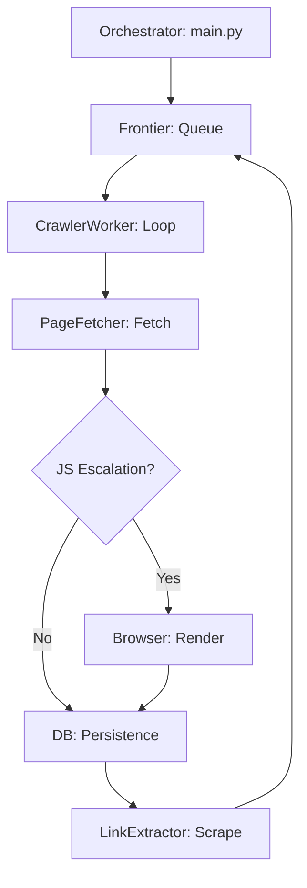

# Web Crawler Engineering Specification: CRAWL Mode

This document is the **Absolute Definitive Authoritative Guide** to the Web Crawler's `CRAWL` mode. It provides a strictly additive, exhaustive technical breakdown of the entire crawling lifecycle, ensuring zero information loss and maximum engineering depth.

---

## 1. System Module Directory (CRAWL-Exclusive)
A comprehensive inventory of the codebase directly impacting the `CRAWL` mode fetch-render-persist-extract pipeline.

### 1.1 Orchestration Layer
- **`main.py`**: The central orchestrator.
  - **Classes**: `FlushingFileHandler` (Ensures atomic log commits during fatal crashes).
  - **Core Logic**:
    - **Heartbeat & Watchdog**: `watchdog_thread()` executes `os._exit(1)` if `LAST_ACTIVITY_TIME` exceeds 900s.
    - **Site Batching**: Implements `BATCH_SIZE = 20` to prevent resource leakage (Open files/connections) by recreating the `ThreadPoolExecutor` for each batch.
    - **WAF Pre-Check**: `test_waf_connectivity()` performs a TCP handshake on port 443 before starting any site tasks.

### 1.2 Configuration & Foundations
- **`crawler/core.py`**: System-wide constants and logging.
  - **Environment Sync**: Maps `.env` variables (`MAX_WORKERS`, `MYSQL_POOL_SIZE`) to shared constants.
  - **Performance Logging**: `CompanyFormatter` ensures timestamps and worker identifiers are standard across all threads.

### 1.3 Execution Logic & Engine
- **`crawler/engine.py`**: The discovery and lifecycle engine.
  - **`ExecutionPolicy`**: Centralized logic for URL qualification, skip rules, and domain-locking.
  - **`Frontier`**: Thread-safe work coordinator managing the `Queue` and `visited`/`in_progress` sets using `threading.Lock`.
  - **`CrawlerWorker`**: The primary execution thread. Implements the smart `fetch` -> `render` -> `persist` -> `extract` loop.

### 1.4 Content Processing Pipeline
- **`crawler/processor.py`**: Low-level network and parsing.
  - **`LinkUtility`**: Manages URL normalization, **Origin Locking** (preserving site identity during redirects), and **Canonical ID** generation.
  - **`PageFetcher`**: Executes network requests. Implements **Manual Redirect Handling** and **Netloc Substitution** for WAF Bypass.
  - **`TrafficControl`**: Global state manager for domain-wide pauses (`429` / `503` recovery).
  - **`LinkExtractor`**: Scrapes the DOM for new links and applies filters.

### 1.5 JS Intelligence & Rendering
- **`crawler/js_engine.py`**:
  - **`BrowserManager`**: Lifecycle wrapper for Playwright/Chromium. Manages `--host-rules` for WAF IP routing.
  - **`JSIntelligence`**: Heuristic engine that triggers JS escalation based on specific DOM patterns (e.g., `#root`, `<app-root>`).

### 1.6 Storage Layer
- **`crawler/storage/mysql.py`**: Manages the `MySQLConnectionPool` and atomic `get_connection()` calls.
- **`crawler/storage/db.py`**: High-level semantic operations (`insert_crawl_page`, `fetch_enabled_sites`).
- **`crawler/storage/db_guard.py`**: Defines the `DB_SEMAPHORE` to enforce pooling limits.
- **`crawler/storage/crawl_reader.py`**: Provides read access to crawled data for verification.

---

## 2. Configuration & CLI Infrastructure

### 2.1 Exhaustive CLI Argument Flow
| Argument | Technical Role | Implementation Impact |
| :--- | :--- | :--- |
| `--siteid` | DB Record Targeting | Filters `sites` list to specific primary keys. |
| `--custid` | Multi-Tenant Filtering| Filters `sites` to all domains owned by the customer. |
| `--baseline_id`| Specific Job Target | Bypasses enabled checks to crawl a specific baseline's target. |
| `--parallel` | System Escalation | Enables `ThreadPoolExecutor` orchestration. |
| `--mode` | Engine Override | Injects `CRAWL`, `BASELINE`, or `COMPARE` behavior. |
| `--log` | Session Auditing | Attaches a `FileHandler` for persistent log storage. |

### 2.2 Environmental Variables (`.env`)
- `MYSQL_POOL_SIZE`: Directly determines the count of `DB_SEMAPHORE` tokens.
- `MIN_WORKERS` / `MAX_WORKERS`: Floor and ceiling for dynamic thread scaling.
- `MAX_PARALLEL_SITES`: Ceiling for concurrent site processing in batch mode.

### 2.3 Technical Definition: `netloc`
During WAF Bypass, the crawler manipulates the **Netloc** (Network Location).
- **Definition**: The authority part of a URL (e.g., `www.example.com`).
- **Logic**: The system swaps the `netloc` with the `waf_ip` in the URL but keeps the original domain in the `Host` header to ensure valid SNI and server-side routing.

---

## 3. Logic & Policy Hub (Exhaustive)

### 3.1 `ExecutionPolicy` Ruleset
| Type | Rule Name | Regex / Value | Intent |
| :--- | :--- | :--- | :--- |
| **Path** | `TAG_PAGE` | `^/(product-)?tag/` | Prevents tag-cloud crawler traps. |
| **Path** | `AUTHOR_PAGE` | `^/author/` | Blocks user profile discovery. |
| **Path** | `PAGINATION` | `/page/\d*/?$` | Skips duplicated list views. |
| **Path** | `ASSET_DIR` | `^/(assets\|static\|...)/` | Skips file directory browsing. |
| **Query**| `PAGINATION` | `(^\|&)(page\|paged\|p)=` | Prevents list-crawl redundancy. |
| **Query**| `SORTING` | `(orderby\|sort\|order)=` | Ignores layout-duplicate pages. |
| **Query**| `ACTIONS` | `(add-to-cart\|remove_item)` | Skips stateful commerce actions. |
| **Query**| `TRACKING` | `(utm_\|_gl=)` | Filters marketing tracking parameters. |

### 3.2 STATIC_EXTENSIONS inventory
The system automatically rejects 20+ file types: `.css`, `.js`, `.png`, `.jpg`, `.jpeg`, `.webp`, `.gif`, `.svg`, `.ico`, `.woff`, `.woff2`, `.ttf`, `.eot`, `.pdf`, `.zip`, `.xlsx`, `.xls`, `.docx`, `.doc`, `.gz`, `.tar`, `.ppt`, `.pptx`, `.mp3`.

### 3.3 Recursion Detection Logic
- **Algorithm**: The system splits the URL path into segments. If more than 2 segments are identical (e.g., `/a/b/a/b/a`), it triggers a `recursion` skip.
- **Sequence Check**: It specifically monitors for repeating path patterns (e.g., `/cat/dog/cat/dog`) to break infinite crawling loops.

---

## 4. Multi-Tier Reliability Stack (The 5-Layer Fallback)

| Tier | Safeguard | Implementation Logic | Log Identifier |
| :--- | :--- | :--- | :--- |
| **1. DB Guard** | `DB_SEMAPHORE` | Blocks until a connection is free (timeout 10s). | `[DB] Semaphore timeout` |
| **2. Routing** | IP -> DNS Fallback| Reverts to DNS if WAF IP probe fails. | `[BYPASS] Falling back to DNS`|
| **3. Render** | HTTPS -> JS | Escalates to Playwright if page is raw JS.| `[FETCH] JS rendering required`|
| **4. Rate Limit**| 5s Pause + Scale | Detects `429` and slows per-domain workers. | `[THROTTLE] Setting PAUSE` |
| **5. Watchdog** | os._exit() | Forced termination on 15m inactivity. | `FATAL: Watchdog timer expired`|

---

## 5. Annotated Cycle Flow: Block-to-Code Mapping



### 5.1 Block-by-Block Code Deep Dive

#### **Block D: Fetching & WAF Bypass**
```python
# PageFetcher.fetch
if waf_ip:
    # DNS Bypass: Replace Netloc, preserve origin domain in Host
    ip_url = urlunparse(parsed._replace(netloc=waf_ip))
    headers["Host"] = parsed.netloc
    response = requests.get(ip_url, headers=headers, verify=False, allow_redirects=False)
```

#### **Block G: DB Persistence**
```python
# insert_crawl_page
# Logic: Smart Upsert. Calculates Canonical ID to prevent domain-redirect drift.
sql = "INSERT INTO crawl_pages (url, status_code, content_hash) VALUES (%s, %s, %s) ON DUPLICATE KEY UPDATE ..."
cursor.execute(sql, (url, status, content_hash))
```

#### **Block H: Sanitized Discovery**
```python
# LinkExtractor.extract
# Logic: Regex-based classification + Domain boundary lock
for a in soup.find_all('a', href=True):
    link = LinkUtility.normalize_url(a['href'], base_url)
    if ExecutionPolicy.is_allowed_domain(seed_url, link):
        frontier.enqueue(link)
```

---

## 6. Appendix: Crawler Summary Tables
Final aggregation logic protected by `SUMMARY_LOCK` in `main.py`.

| Metric | Derivation Logic | Technical Dependency |
| :--- | :--- | :--- |
| **Total Attempted**| Atomic total of all de-queued items.| `Frontier.visited` count |
| **Newly Saved** | Sum of successful `INSERT` actions. | `Action: Inserted` |
| **Already in DB** | Sum of `Existed` reports from DB logic. | `Action: Existed` |
| **Throttles** | Total `429` / `503` events caught. | `TrafficControl.pauses` |
| **JS Rendering** | Count of escalated Playwright tasks. | `JSRenderWorker` total |
