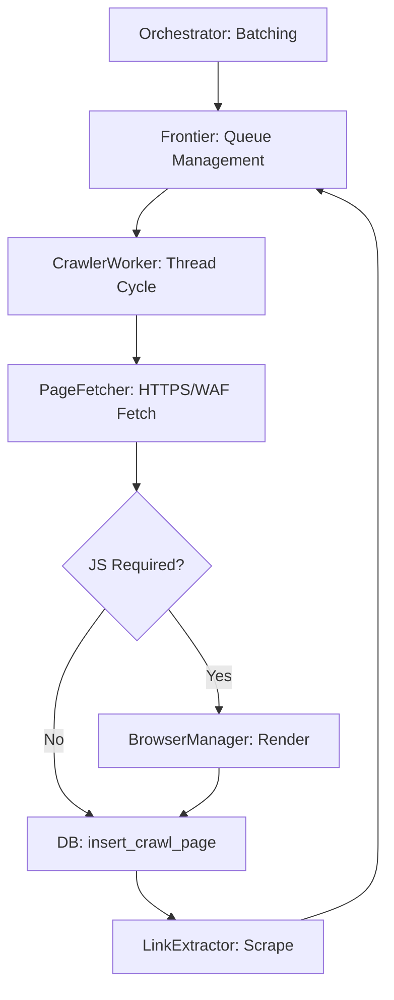

# Web Crawler Engineering Specification: CRAWL Mode

This document is the **Absolute Definitive Authoritative Guide** to the Web Crawler's `CRAWL` mode. It provides a strictly additive, exhaustive technical breakdown of every system layer, from socket-level routing to high-level orchestration.

---

## 1. System Module Directory
An exhaustive inventory of the codebase, detailing the technical purpose and logic of every major component.

### 1.1 Orchestration Layer
- **`main.py`**: The central orchestrator.
  - **Classes**: `FlushingFileHandler` (Ensures atomic log commits to disk during fatal crashes).
  - **Functions**:
    - `main()`: Entry point. Handles `argparse`, environment synchronization, and `ThreadPoolExecutor` batching.
    - `resolve_seed_url()`: Technical variation-prober. Attempts `https://domain.com` and `https://www.domain.com` variations to find the primary responding target.
    - `test_waf_connectivity()`: Performs a TCP handshake (port 443) on WAF IPs to prevent the crawler from hanging on dead/zombie origin IPs.
    - `watchdog_thread()`: System safety daemon. Forcefully executes `os._exit(1)` if `LAST_ACTIVITY_TIME` exceeds 900s.
    - `crawl_site()`: The per-domain context manager. Initializes the `Frontier`, handles per-site log files, and spawns the `CrawlerWorker` pool.

### 1.2 Configuration & Foundations
- **`crawler/core.py`**: Foundational configuration.
  - **Classes**: `CompanyFormatter` (Standardizes log headers for corporate audit).
  - **Functions**: `setup_logger()` (Initializes global parent logger with parallel-safe handlers).
  - **Constants**: Maps `.env` constraints to runtime logic (`MIN_WORKERS`, `MAX_WORKERS`, `MAX_PARALLEL_SITES`).

### 1.3 Execution Logic
- **`crawler/engine.py`**: Manages the discovery lifecycle.
  - **Classes**:
    - `ExecutionPolicy`: Defines static regex-based skip rules (Tags, Assets, Pagination).
    - `Frontier`: Thread-safe work coordinator managing the `Queue` and `visited`/`in_progress` sets.
    - `CrawlerWorker`: The primary executor thread implementing the `fetch-render-persist-extract` cycle.

### 1.4 Content Processing
- **`crawler/processor.py`**: Network and parsing infrastructure.
  - **Classes**:
    - `LinkUtility`: URL sanitization, **Canonical ID** generation, and **Origin Locking**.
    - `TrafficControl`: implements **Domain-Wide Pause** triggered by `429` errors.
    - `PageFetcher`: Managed HTTP/HTTPS requests with manual redirect and WAF bypass logic.
    - `LinkExtractor`: Scrapes DOM for new links and filters them via `ExecutionPolicy`.

### 1.5 Render Escalation
- **`crawler/js_engine.py`**:
  - **Classes**: `BrowserManager` (Playwright wrapper), `JSIntelligence` (SPA detection).

### 1.6 Storage & Persistence
- **`crawler/storage/mysql.py`**: Low-level connection pooling and semaphore acquisition.
- **`crawler/storage/db.py`**: Semantic data operations (`insert_crawl_page`, `fetch_enabled_sites`).
- **`crawler/storage/db_guard.py`**: Global `DB_SEMAPHORE` definition.

---

## 2. Requirements & Dependency Spec
Extensive breakdown of third-party libraries and their role in `CRAWL` mode.

| Library | Role | Technical Implementation & Interaction |
| :--- | :--- | :--- |
| `requests` | **Network Core** | Executes synchronous HTTPS fetching. Utilizes `urllib3` for connection pooling. Handles manual 3xx hops to maintain WAF routing. |
| `playwright`| **DOM Rendering** | Spawns Chromium logic. Used for SPAs or when standard HTTPS probes hit WAF routing errors. |
| `beautifulsoup4`| **Parsing** | Uses the `lxml` engine for high-speed HTML tree building and tag extraction. |
| `mysql-connector`| **Persistence** | Implements the `MySQLConnectionPool`. Coordinates with `DB_SEMAPHORE` for thread-safe access. |
| `tldextract` | **Boundary Lock** | Extracts the `registered_domain` to prevent "domain drift" even after redirects. |
| `python-dotenv` | **Orchestration** | Synchronizes system scaling (`MAX_WORKERS`) with database connection limits. |
| `psutil` | **Telemetry** | Monitors system memory and CPU usage during large batch runs. |
| `brotli` | **Decompression** | Essential for decoding high-compression headers from Cloudflare/Akamai WAFs. |

---

## 3. Configuration & CLI Infrastructure

### 3.1 Environmental Variables (`.env`)
- `MYSQL_POOL_SIZE`: Directly determines the `DB_SEMAPHORE` token count.
- `MIN_WORKERS` / `MAX_WORKERS`: Controls the lower/upper bounds of threads per domain.
- `MAX_PARALLEL_SITES`: Number of concurrent domains allowed in `ThreadPoolExecutor`.

### 3.2 CLI Argument Infrastructure
| Argument | Technical Use Case | Code Impact |
| :--- | :--- | :--- |
| `--siteid` | Target specific DB records. | Filters the `sites` list to specific Primary Keys. |
| `--custid` | Customer-level orchestration. | Filters `sites` to all domains associated with the ID. |
| `--log` | Session auditing. | Attaches `FlushingFileHandler` to record session to disk. |
| `--mode` | Engine behavior override. | Cascades to `CrawlerWorker` (CRAWL, BASELINE, COMPARE). |
| `--parallel` | High-concurrency mode. | Enables `ThreadPoolExecutor` in `main.py`. |

### 3.3 Technical Definition: `netloc`
- **Definition**: The "Network Location" part of a URL (e.g., `www.google.com`).
- **WAF Bypass Logic**: The crawler swaps the `netloc` with the `waf_ip` while maintaining the original domain in the `Host` header. This bypasses DNS while satisfying SNI checks.

---

## 4. Execution Policy & Skip Rules

### 4.1 Regex Path Skip Rules
| Rule | Pattern | Purpose |
| :--- | :--- | :--- |
| `TAG_PAGE` | `^/(product-)?tag/` | Prevents tag-cloud crawling loops. |
| `AUTHOR_PAGE`| `^/author/` | Avoids user profile crawling. |
| `PAGINATION` | `/page/\d*/?$` | Skips numbered list pages. |
| `ASSETS` | `^/(assets|js|css)/` | Prevents direct file directory crawling. |

### 4.2 Query-Param Filtering
URLs containing `utm_`, `_gl`, `sort`, `orderby`, or `add-to-cart` are rejected to prevent state-leakage and irrelevant crawling.

---

## 5. The Fallback Hierarchy (Five-Tier Reliability)

### 5.1 Tier 1: DB Starvation protection
- **Logic**: Threads must acquire `DB_SEMAPHORE` before borrowing from the pool.
- **Snippet**: `acquired = DB_SEMAPHORE.acquire(timeout=10)`

### 5.2 Tier 2: Routing Fallback (WAF -> Public DNS)
- **Logic**: If the TCP probe to `waf_ip` fails, the system reverts to standard Public DNS record fetching.

### 5.3 Tier 3: Rendering Fallback (HTTPS -> JS escalation)
- **Logic**: If initial probe reveals a blank SPA or `#root` content, escalates to **Playwright**.

### 5.4 Tier 4: Rate Limit Recovery
- **Logic**: Detects `429`. Signals `TrafficControl` for a domain-wide 5s pause and scale-down.

### 5.5 Tier 5: System Watchdog
- **Logic**: Hard reset (`os._exit(1)`) if no log activity is detected for 15 minutes.

---

## 6. Phase-by-Phase I/O Flow Mapper
| Module | Function | Input | Output |
| :--- | :--- | :--- | :--- |
| `main.py` | `resolve_seed_url`| `raw_url` | `validated_https_url` |
| `engine.py` | `Frontier.enqueue` | `url`, `origin` | `Enqueued / Skip / Duplicate` |
| `processor.py`| `PageFetcher.fetch` | `url`, `waf_ip` | `response_payload` |
| `mysql.py` | `insert_crawl_page` | `metadata` | `Inserted / Existed` |
| `processor.py`| `LinkExtractor` | `html_buffer` | `List[sanitized_urls]` |

---

## 7. Annotated Cycle Flow: The Discovery Loop



### 7.1 Block-by-Block Code Deep Dive

#### **Block D: Fetch Logic (`processor.py`)**
Handles the core WAF bypass and HTTPS upgrade.
```python
# PageFetcher.fetch snippet
if waf_ip:
    # Logic: DNS Bypass - Substitute netloc with IP, keep Host header for SNI
    ip_url = urlunparse(parsed._replace(netloc=waf_ip))
    headers["Host"] = parsed.netloc
    response = requests.get(ip_url, headers=headers, verify=False, allow_redirects=False)
```

#### **Block G: DB Persistence (`mysql.py`)**
Ensures every discovery attempt is recorded with structural integrity.
```python
# insert_crawl_page snippet
# Logic: ON DUPLICATE KEY UPDATE ensures we update existing pages 
# while generating a stable Canonical ID via LinkUtility.
sql = "INSERT INTO crawl_pages (url, status_code, content_hash) VALUES (%s, %s, %s) ..."
cursor.execute(sql, (url, status, hash))
```

#### **Block H: Link Extraction (`processor.py`)**
Parses content and applies the `ExecutionPolicy` filters.
```python
# LinkExtractor snippet
# Logic: BS4 extracts anchors -> Filtered by ExecutionPolicy regex and Domain boundary checks
soup = BeautifulSoup(html, 'lxml')
for a in soup.find_all('a', href=True):
    link = LinkUtility.normalize_url(a['href'], base_url)
    if ExecutionPolicy.is_allowed_domain(seed_url, link):
        frontier.enqueue(link)
```

---

## 8. Appendix: Crawler Summary Tables
Final aggregation logic protected by `SUMMARY_LOCK` in `main.py`.

| Metric | Source Calculation Logic |
| :--- | :--- |
| **Total URLs Attempted**| Sum of all de-queued items from the Frontier. |
| **Newly Saved** | Count of URLs with `Action: Inserted` in `crawl_pages`. |
| **Already in DB** | Count of URLs with `Action: Existed` in `crawl_pages`. |
| **Redirects** | Total manual 3xx hops identified in `PageFetcher`. |
| **JS Rendering** | Total successful Chromium cycles in `BrowserManager`. |
